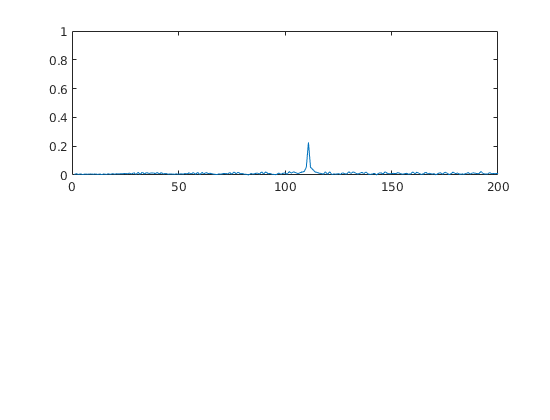

# SFND Radar Target Generation and Detection

#### 1. FMCW Waveform Design
Using the given system requirements, design a FMCW waveform. Find its Bandwidth (B), chirp time (Tchirp) and slope of the chirp.

```Matlab
%%%%%%%%%%%%%%%%%%%%%%%%%%%
Frequency_of_operation = 77e9;
Max_Range = 200;
Range_Resolution = 1;
Max_Velocity = 100;
%%%%%%%%%%%%%%%%%%%%%%%%%%%

speed_of_light = 3e8;


fc= 77e9;             %carrier freq
sweep_time_factor = 5.5;

B      = speed_of_light / (2 * Range_Resolution); % Bandwidth of the FMCW, Bsweep
Tchirp = (sweep_time_factor*2*Max_Range)/speed_of_light; % Chirp Time of the FMCW
slope = B/Tchirp; %slope of the FMCW  
```

#### 2. Simulation Loop
Simulate Target movement and calculate the beat or mixed signal for every timestamp.

```Matlab
R = 100;         %initial position 
v = 50;        %initial velocity

%The number of chirps in one sequence. Its ideal to have 2^ value for the ease of running the FFT
%for Doppler Estimation. 
Nd=128;                   % #of doppler cells OR #of sent periods % number of chirps

%The number of samples on each chirp. 
Nr=1024;                  %for length of time OR # of range cells

% Timestamp for running the displacement scenario for every sample on each
% chirp
t=linspace(0,Nd*Tchirp,Nr*Nd); %total time for samples


%Creating the vectors for Tx, Rx and Mix based on the total samples input.
Tx=zeros(1,length(t)); %transmitted signal
Rx=zeros(1,length(t)); %received signal
Mix = zeros(1,length(t)); %beat signal

%Similar vectors for range_covered and time delay.
r_t=zeros(1,length(t));
td=zeros(1,length(t));
```

#### 3. Range FFT (1st FFT)

Implement the Range FFT on the Beat or Mixed Signal and plot the result.

```Matlab
Mix = reshape(Mix,[Nr,Nd]);

 % *%TODO* :
%run the FFT on the beat signal along the range bins dimension (Nr) and
%normalize.
sig_fft = fft(Mix,Nr);  
sig_fft = sig_fft./Nr;

% *%TODO* :
% Take the absolute value of FFT output
sig_fft = abs(sig_fft);  

 % *%TODO* :
% Output of FFT is double sided signal, but we are interested in only one side of the spectrum.
% Hence we throw out half of the samples.
single_side_sig_fft = sig_fft(1:Nr/2);


%plotting the range
figure ('Name','Range from First FFT')
subplot(2,1,1)

% *%TODO* :
% plot FFT output 
plot(single_side_sig_fft); 
```


#### 4. doppler FFT (2st FFT)

```Matlab
Mix=reshape(Mix,[Nr,Nd]);

% 2D FFT using the FFT size for both dimensions.
sig_fft2 = fft2(Mix,Nr,Nd);

% Taking just one side of signal from Range dimension.
sig_fft2 = sig_fft2(1:Nr/2,1:Nd);
sig_fft2 = fftshift (sig_fft2);
RDM = abs(sig_fft2);
RDM = 10*log10(RDM) ;

%use the surf function to plot the output of 2DFFT and to show axis in both
%dimensions
doppler_axis = linspace(-100,100,Nd);
range_axis = linspace(-200,200,Nr/2)*((Nr/2)/400);
figure,surf(doppler_axis,range_axis,RDM);
```


#### 5. 2D CFAR
Implement the 2D CFAR process on the output of 2D FFT operation, i.e the Range Doppler Map.

Determine the number of Training cells for each dimension. Similarly, pick the number of guard cells.

```Matlab
Tcr = 10;      %the number of Training Cells in both the dimensions.
Tcd = 4;

Gcr = 4;       %the number of Guard Cells in both dimensions around the 
Gcd = 4;       %Cell under test (CUT) for accurate estimation
      
offset = 1.4;  % offset the threshold by SNR value in dB
```

Create a vector to store noise_level for each iteration on training cells，Design a loop such that it slides the CUT across range doppler map by gicing margins at the edges for Training and Guard cells.

```Matlab
RDM = RDM/max(max(RDM));

for i = Tr+Gr+1:(Nr/2)-(Gr+Tr)
    for j = Td+Gd+1:Nd-(Gd+Td)
        
       % Create a vector to store noise_level for each iteration on training cells
        noise_level = zeros(1,1);
        
        % Calculate noise SUM in the area around CUT
        for p = i-(Tr+Gr) : i+(Tr+Gr)
            for q = j-(Td+Gd) : j+(Td+Gd)
                if (abs(i-p) > Gr || abs(j-q) > Gd)
                    noise_level = noise_level + db2pow(RDM(p,q));
                end
            end
        end
```

* For every iteration sum the signal level within all the training cells.
* Average the summed values for all of the training cells used
* Add the offset to determine the threshold
* Compare the signal under CUT with this threshold
* If the CUT level > threshold assign %it a value of 1, else equate it to 0.

```Matlab
% Calculate threshould from noise average then add the offset
        threshold = pow2db(noise_level/(2*(Td+Gd+1)*2*(Tr+Gr+1)-(Gr*Gd)-1));
        threshold = threshold + offset;
        CUT = RDM(i,j);
        
        if (CUT < threshold)
            RDM(i,j) = 0;
        else
            RDM(i,j) = 1;
        end
    end
end
```

* The process above will generate a thresholded block, which is smaller than the Range Doppler Map as the CUT cannot be located at the edges of matrix. Hence,few cells will not be thresholded. To keep the map size same set those values to 0.

```Matlab
RDM(union(1:(Tr+Gr),end-(Tr+Gr-1):end),:) = 0;  % Rows
RDM(:,union(1:(Td+Gd),end-(Td+Gd-1):end)) = 0;  % Columns 
```


figure('Name','CA-CFAR Filtered RDM')
surf(doppler_axis,range_axis,RDM);
colorbar;
